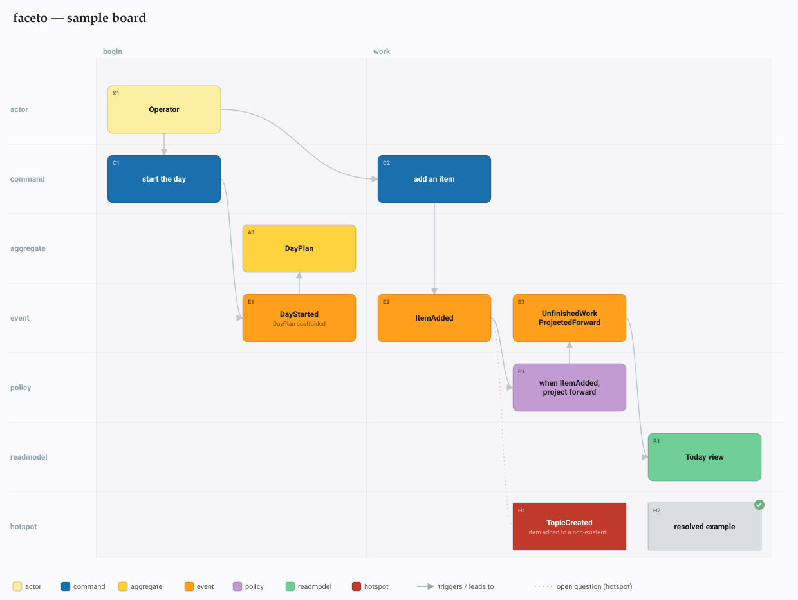
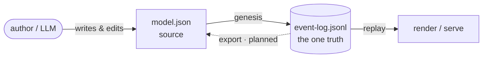
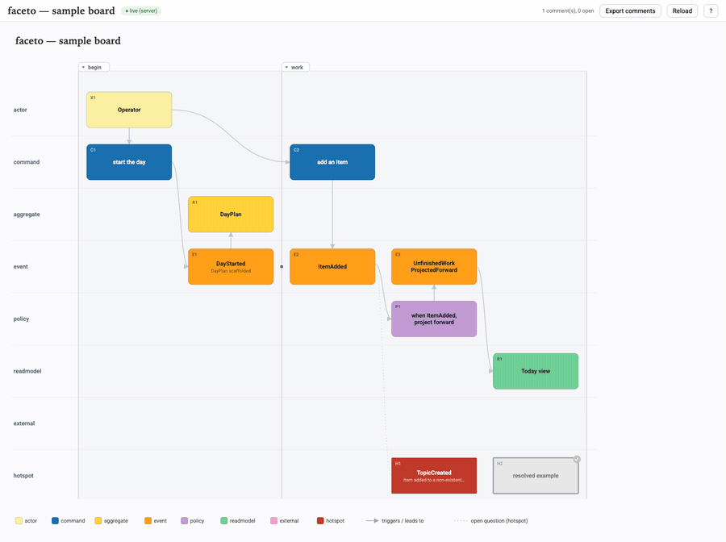

<!-- markdownlint-disable MD013 MD033 MD041 -->

<p align="center">
  <picture>
    <source media="(prefers-color-scheme: dark)" srcset="docs/faceto-logo/faceto-wordmark-white.svg">
    
  </picture>
</p>

# faceto

[](https://github.com/bastien-gallay/faceto/actions/workflows/ci.yml)
[](#why-zero-dependencies)

**A simple typed file → a visual workshop board you think through with an LLM.**

Point it at a model; get an interactive HTML+SVG board you can read at a glance and
**click any element → write a short note → have your next session adjust the model**.
Event storming is the first board format; C4, story mapping, impact mapping and friends are
the direction. Pure Rust standard library — **zero dependencies, offline, one fast install**.

<p align="center">
  
</p>

The name reads two ways, both true: **face-to**(-face — the thing you discuss *with* the model)
and **facet-o** (many facets cut from one typed source).

*Jump to* — [install](#install) · [the model file](#the-model-file) · [event log](#the-event-log-is-the-source-of-truth) · [the eight lanes](#the-eight-lanes) · [why zero deps](#why-zero-dependencies)

## Install

```bash
cargo install --path .          # puts `faceto` on your PATH (~/.cargo/bin)
```

No network, no crates to download — it builds from the standard library alone.

## 30-second tour

```bash
faceto render examples/sample.model.json   # writes board.svg + index.html next to the model
open examples/index.html                   # the board above, straight from that render

faceto lint  examples/sample.model.json    # event-storming grammar findings (warn-only, exits 0)

faceto serve examples/sample.model.json    # live board → http://127.0.0.1:8753
# click a sticky → modal → pick a kind → type a note → Save
```

## The model file

You author a board as one typed JSON file — a slice of [`examples/sample.model.json`](examples/sample.model.json):

```json
{
  "title": "faceto — sample board",
  "phases": [{ "label": "work", "fromCol": 2, "toCol": 4 }],
  "elements": [
    { "id": "C2", "type": "command",   "label": "add an item",                  "col": 2 },
    { "id": "E2", "type": "event",     "label": "ItemAdded",                     "col": 2 },
    { "id": "P1", "type": "policy",    "label": "when ItemAdded, project forward", "col": 3 },
    { "id": "H1", "type": "hotspot",   "label": "TopicCreated (item added to a non-existent topic)", "col": 3 }
  ],
  "edges": [["C2", "E2"], ["E2", "P1"], ["H1", "E2"]]
}
```

- **`type`** is the colour grammar / lane — one of the [eight lanes](#the-eight-lanes).
- **`col`** is a *global* timeline coordinate shared across all lanes (left→right = time). Order
  within a lane is just `sort by col`. Missing `col` auto-assigns in file order.
- **`id`** is the stable identity — the comment join key and the diff key. Never renumber; only add.
- A trailing `(parenthetical)` or an explicit **`detail`** field becomes the sticky's smaller
  second line. A hotspot with **`"resolved": true`** goes quiet (grey + check) instead of loud red.

## The event log is the source of truth



`model.json` is the **source** you author — by hand or with an LLM. The durable record is a
separate, **append-only event log** (`event-log.jsonl`); the board you see is a *projection*
replayed from that log, and comments are **first-class events**. `faceto genesis` imports a source
model into its founding log:

```bash
faceto genesis examples/sample.model.json   # → examples/event-log.jsonl (one-time)
faceto render  examples/event-log.jsonl     # render/serve also accept a log (by extension)
faceto compact examples/event-log.jsonl     # fold history to a snapshot, bounding replay
```

Each line is one event — a slice of the generated [`examples/event-log.jsonl`](examples/event-log.jsonl):

```jsonl
{"event":"BoardTitled","title":"faceto — sample board"}
{"event":"ElementAdded","id":"C2","type":"command","label":"add an item","col":2}
{"event":"ElementAdded","id":"E2","type":"event","label":"ItemAdded","col":2}
{"event":"EdgeAdded","src":"C2","dst":"E2"}
{"event":"HotspotResolved","id":"H2","resolution":""}
{"event":"ElementMoved","id":"H1","col":3}
```

`replay` is pure and deterministic: same log → same board. The schema evolves *additively* (new
optional fields, new event kinds) so old and new logs stay mutually replayable. `event-log.jsonl`
is **tracked** in git; the rendered `board.svg` / `index.html` are derived and ignored. The full
rationale — compaction, forward/backward compatibility, the locked decisions — lives in
[`docs/event-sourcing-status.md`](docs/event-sourcing-status.md).

## Click → note → event

With `serve` running, click a sticky → a modal opens → pick a kind (`comment` / `add` / `split` /
`rename` / `drop` / `move` / `question` / `resolve`) → type a short note → **Save**.

The note is appended to the log as the matching event — `add` mints a server-side, type-prefixed
id (`E5`, `C3`, …), one past the highest ever used under that lane, computed under a lock so
concurrent adds can't collide. (Point `serve` at a bare `model.json` and it auto-migrates to a
sibling `event-log.jsonl` first, so the server only ever writes the log.) The page also works
offline — comments queue in `localStorage`, and **Export comments** keeps anything not yet applied.

## Reload shows what changed

<!--
  TODO(diff-loop capture): the hero above proves faceto *renders* a board; this is the section that
  needs a second visual to prove it *shows what changed*. Capture a GIF of annotate → Reload → diff
  overlay and drop it in here. Once docs/diff-loop.gif exists, uncomment:
  <p align="center"></p>
-->

**Reload** re-pulls the log and, when it has grown under you, redraws the board with a **diff
overlay against the version you were just looking at** — no git, no page reload. Joined on `id`: a
reworded or relocated sticky reads as **changed** / **moved**, not drop-plus-add. **Plain** clears
the overlay and re-baselines.

## The eight lanes

`type` selects both the lane (a fixed top-to-bottom order) and the colour:

| Lane | Means | Colour |
| --- | --- | --- |
| `actor` | a person / role that acts | `#FCEFA1` |
| `command` | an intent / request | `#1A6FAE` |
| `aggregate` | the consistency boundary it lands on | `#FFD23F` |
| `event` | something that happened (past tense) | `#FF9F1C` |
| `policy` | a reaction: *when X, do Y* | `#C39BD3` |
| `readmodel` | a view the actor reads | `#6FCF97` |
| `external` | a system outside the boundary | `#F2A0C9` |
| `hotspot` | an open question / risk (loud red until resolved) | `#C0392B` |

## Why zero dependencies

`faceto` is a working instrument you reach for mid-thought, so install has to be trivial and
offline. The shipped binary carries **zero runtime dependencies** — pure Rust std: JSON is parsed
by a small hand-written module (`src/json.rs`), the server is `std::net` only. Nothing to download,
nothing to audit at install time. Two CI jobs guard it: a `zero dependencies` firewall on the
runtime (`cargo tree -e normal`) dependency tree, and a **binary-size budget** on the shipped
binary. Test-only **dev-dependencies don't count** — they never enter the binary or the install, so
`proptest` (which powers the property-based tests) is free.

## Development

```bash
cargo test --all-targets                          # unit tests
cargo fmt --all --check                           # formatting
cargo clippy --all-targets -- -D warnings         # lints
```

These mirror CI, which also runs the test + clippy matrix on macOS, Windows, and Linux. See
[CONTRIBUTING.md](CONTRIBUTING.md) for the (one) hard rule and [AGENTS.md](AGENTS.md) for the
architecture and domain invariants.

## Status

Extracted from the daily-ops inception event-storm harness. The event-sourced spine is the current
shape: the log is truth, the model is a projection, comments are events. Next: more board formats, a
`reorder` affordance (per-sticky nudge + backward-edge contradiction styling), and a short animated
capture of the live click→note→diff loop (slot reserved under [Reload shows what changed](#reload-shows-what-changed)).
Also planned: a `model.json` **export** (project the log back to a source file) — see
[ROADMAP.md](ROADMAP.md). The **runtime-only** dependency policy (dev-deps free + a binary-size
budget) has since landed.
